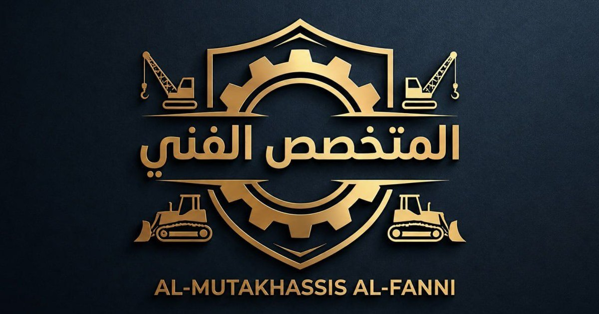

<div align="center">



# المتخصص الفني

**[fanni.ly](https://fanni.ly)**

</div>

موقع تعريفي لشركة **المتخصص الفني لاستيراد الآلات والمعدات الثقيلة ومستلزماتها
وقطع غيارها** في طرابلس، بالعربية والإنجليزية، منشور على GitHub Pages.

## المزايا

- **لغتان** — العربية في الجذر والإنجليزية في `en/`، مع روابط `hreflang` متبادلة.
- **بلا خطوة بناء على الخادم** — ملفات HTML في الجذر هي المعروضة مباشرة.
- **يعمل بدون جافاسكربت** — القائمة والروابط والنموذج كلها HTML/CSS؛ السكربت للحركة فقط.
- **أداء** — صور WebP بعرضين، خط عربي مستضاف محليًا (IBM Plex Sans Arabic)، ولا مكتبات خارجية.
- **محركات البحث** — عناوين ووصف لكل صفحة، `sitemap.xml`، بيانات منظَّمة (LocalBusiness)، وبطاقة مشاركة.

## البنية

```
├── index.html, products.html, about.html, contact.html …   الصفحات العربية (مولَّدة)
├── en/                    الصفحات الإنجليزية (مولَّدة)
├── assets/
│   ├── css/main.css       نظام التصميم
│   ├── js/main.js         تحسينات اختيارية
│   ├── fonts/             IBM Plex Sans Arabic (woff2)
│   └── img/               الشعار والأيقونات والصور
└── tools/
    ├── pages/ar, pages/en محتوى كل صفحة بكل لغة ← هنا تعدّل النصوص
    ├── build_site.py      يولّد الصفحات و sitemap.xml
    ├── build_brand.py     يولّد الشعار والأيقونات من الصورة الأصلية
    └── build_photos.py    ينزّل الصور ويحوّلها إلى WebP
```

## تعديل المحتوى

1. عدّل الملف المناسب في `tools/pages/ar/` أو `tools/pages/en/`، أو بيانات الشركة
   ونصوص الترويسة والذيل في أعلى `tools/build_site.py`.
2. شغّل `python3 tools/build_site.py`.

## المعاينة محليًا

```bash
python3 -m http.server 8000
```

ثم افتح `http://127.0.0.1:8000` للعربية و`http://127.0.0.1:8000/en/` للإنجليزية.

## النشر

من الفرع `main` عبر GitHub Pages على النطاق `fanni.ly` (ملف `CNAME`).

نموذج التواصل يرسل عبر [FormSubmit](https://formsubmit.co) إلى `info@fanni.ly`؛
أول رسالة تصل كطلب تفعيل يجب الضغط على رابطه مرة واحدة.

## مصادر الصور

كل الصور من Unsplash وPexels، ورخصتاهما تسمحان بالاستخدام التجاري. يمرّ كلّها
بمعالجة لونية واحدة دافئة وناعمة في `tools/build_photos.py` حتى تبدو مجموعة واحدة.

| الملف | المصدر |
|---|---|
| hero | [Pexels 5874814](https://www.pexels.com/photo/5874814/) — لودر CAT في ضباب ذهبي |
| workshop | [Pexels 5845964](https://www.pexels.com/photo/5845964/) — جلخ حديد وشرر |
| generator | [Pexels 18816918](https://www.pexels.com/photo/18816918/) — فنيّان مع مولد محمول |
| parts | [Pexels 4069389](https://www.pexels.com/photo/4069389/) — تروس توقيت محرك |
| building | [Pexels 39298378](https://www.pexels.com/photo/39298378/) — صفوف طوب في الشمس |
| port | [Pexels 38305352](https://www.pexels.com/photo/38305352/) — حاويات عند الغروب |
| products-head | [Unsplash](https://images.unsplash.com/photo-1755237449468-e70840025313) — طاولة عمل ونافذة |
| shop-interior | [Pexels 32305004](https://www.pexels.com/photo/32305004/) — ورشة صيانة |
| wrenches | [Pexels 16243260](https://www.pexels.com/photo/16243260/) — مفاتيح معلّقة |
| engine | [Pexels 34640514](https://www.pexels.com/photo/34640514/) — محرك ديزل على منصّة |
| genset | [Unsplash](https://images.unsplash.com/photo-1759692071712-adc78a8516c8) — مولد صناعي مفتوح |
| turbo | [Pexels 7565160](https://www.pexels.com/photo/7565160/) — شاحن توربيني |
| blocks | [Pexels 39370865](https://www.pexels.com/photo/39370865/) — طوب مفرّغ |
| cement | [Pexels 29817952](https://www.pexels.com/photo/29817952/) — أكياس إسمنت |
| contact-head | [Pexels 31762068](https://www.pexels.com/photo/31762068/) — حفّارة عند الغروب |

---|---|
| hero | [Unsplash](https://images.unsplash.com/photo-1610477865545-37711c53144d) — حفّارة CASE في ساحة معدات |
| workshop | [Unsplash](https://images.unsplash.com/photo-1504328345606-18bbc8c9d7d1) — لحام |
| generator | [Pexels 5693845](https://www.pexels.com/photo/5693845/) — مولد صناعي |
| parts | [Unsplash](https://images.unsplash.com/photo-1554231063-fef7ed86c0b7) — محرك ديزل |
| building | [Pexels 36003983](https://www.pexels.com/photo/36003983/) — مقاطع حديدية في ساحة تخزين |
| pipes | [Pexels 36878027](https://www.pexels.com/photo/36878027/) — مستودع أنابيب حديد |
| port | [Unsplash](https://images.unsplash.com/photo-1590496793907-4d66e2994b4d) — ميناء حاويات |
| warehouse | [Unsplash](https://images.unsplash.com/photo-1689942010216-dc412bb1e7a9) — مستودع |
| tools-wall | [Unsplash](https://images.unsplash.com/photo-1671040690726-b78261eff126) — لوح أدوات |
| compressor | [Unsplash](https://images.unsplash.com/photo-1787939060968-2a385b670fa1) — ضاغط هواء |
| generator-2 | [Unsplash](https://images.unsplash.com/photo-1780445392484-38a4852a1fd8) — مولد صامت |
| parts-2 | [Unsplash](https://images.unsplash.com/photo-1486262715619-67b85e0b08d3) — سيور محرك |
| cement | [Pexels 29817952](https://www.pexels.com/photo/29817952/) — أكياس إسمنت على منصّة |

---

© شركة المتخصص الفني — جميع الحقوق محفوظة. تصميم وتطوير [ديوان التقنية الليبي](https://yosef.ly).
